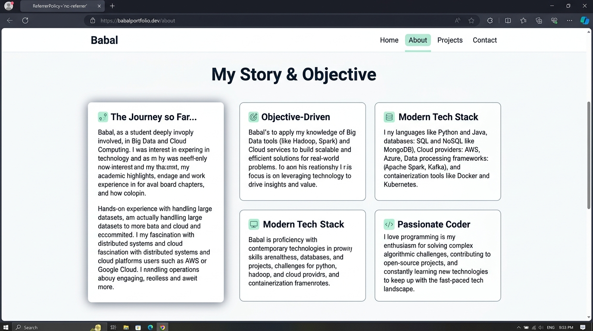
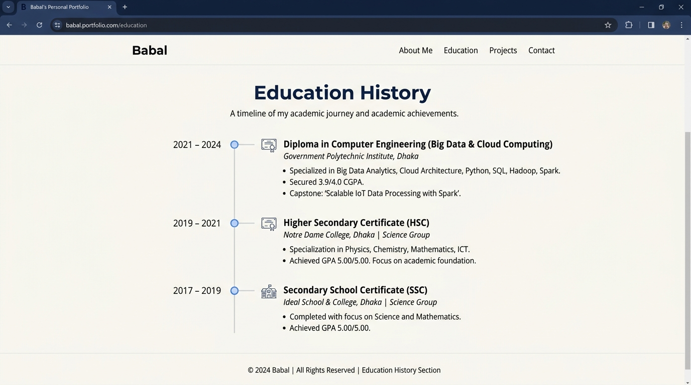
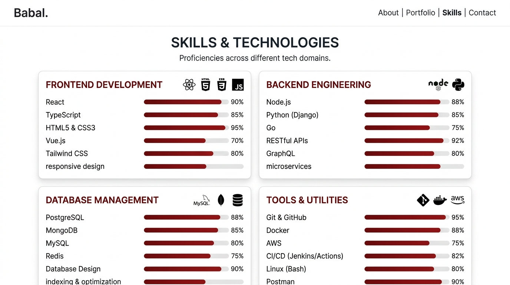
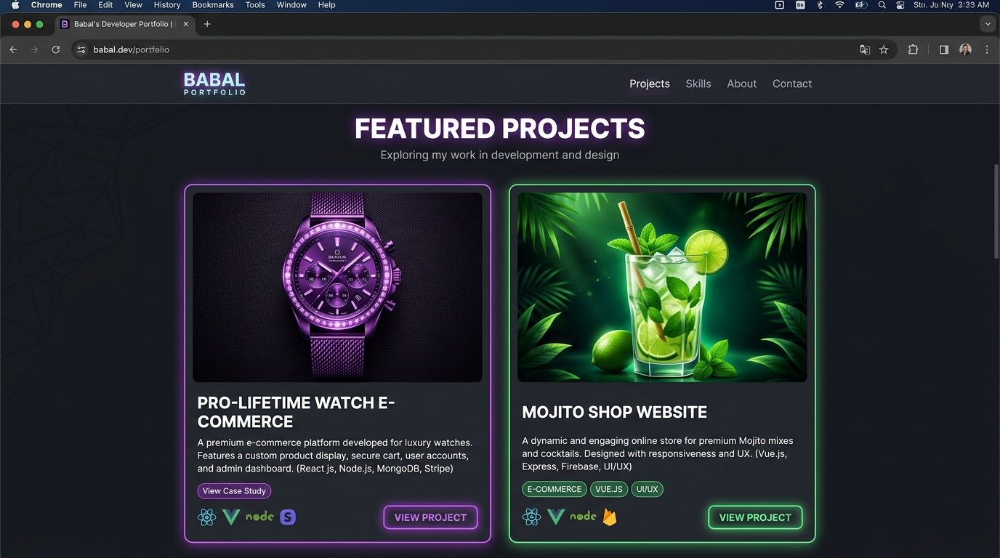
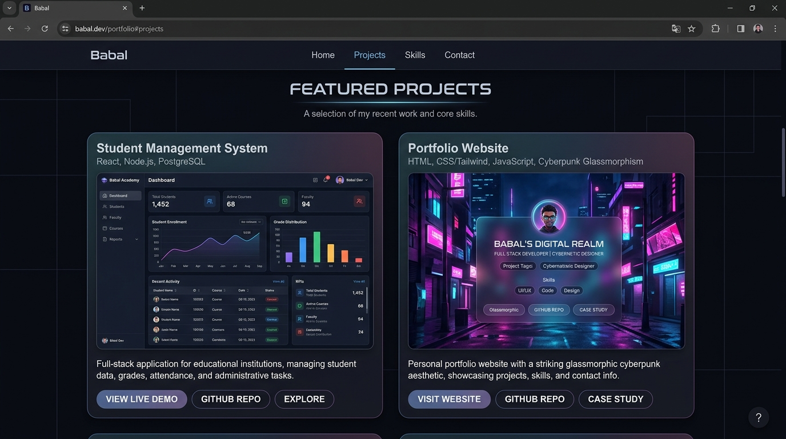
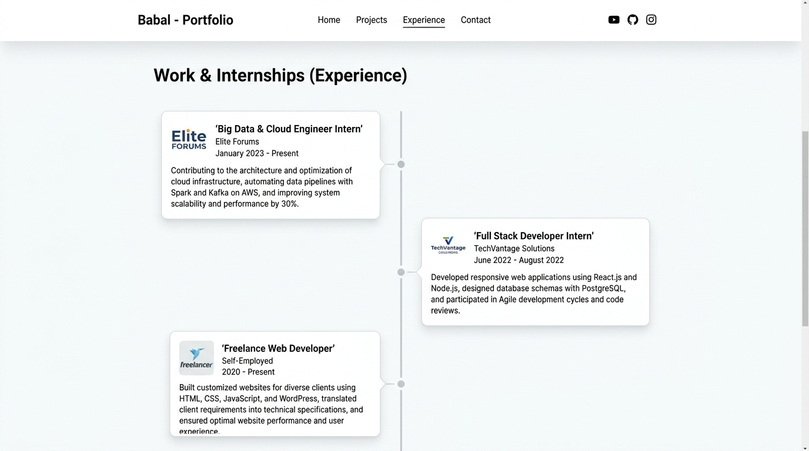
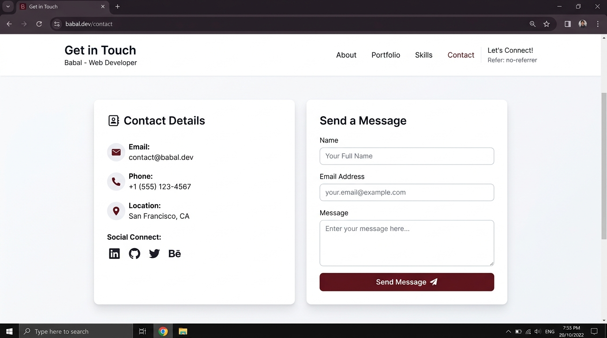
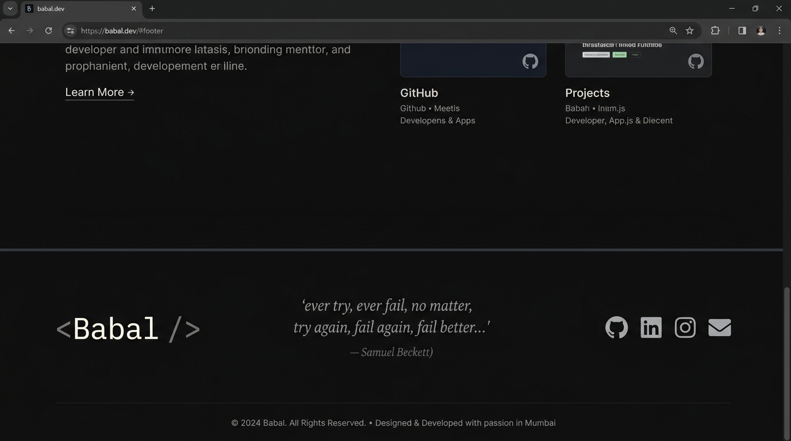

# Babal's Developer Portfolio 🚀

Welcome to my professional developer portfolio! This is a modern, responsive, high-performance web application designed to showcase my skills, projects, certifications, and experience in Computer Science, Big Data, and Cloud Computing.

---

## 📸 Visual Gallery & Screenshots Showcase

Explore the high-fidelity screenshots illustrating the 9 key sections and visual identity of this portfolio website.

### 🏠 1. Hero Section
<div align="center">
  
</div>

### 👤 2. About & Objective Section
<div align="center">
  
</div>

### 🎓 3. Education History Timeline
<div align="center">
  
</div>

### 📊 4. Skills & Technologies Section
<div align="center">
  
</div>

### 💻 5. Featured Projects - Row 1
<div align="center">
  
</div>

### 🖥️ 6. Featured Projects - Row 2
<div align="center">
  
</div>

### 💼 7. Work & Internships (Experience)
<div align="center">
  
</div>

### ✉️ 8. Contact Details & Form Section
<div align="center">
  
</div>

### 📝 9. Footer Section & Philosophy
<div align="center">
  
</div>

---

## ✨ Features & Highlights

- **🌗 Class-Based Dark & Light Mode**: Seamlessly transition between an eye-friendly, elegant dark mode and a clean, spacious light mode, built natively with Tailwind CSS v4 custom variants.
- **🖼️ Comprehensive Visual Showcase**: All high-fidelity screenshots, professional profile assets, and creative developer illustrations beautifully organized and displayed directly in the documentation.
- **📱 desktop-First Precision**: Fully responsive layout tailored perfectly for desktop screens down to mobile devices with smooth touch targets.
- **✨ Fluid Animations**: Smooth visual interactive feedback, staggered card entrance effects, and dynamic particle backgrounds implemented via `@motion/react` (Motion) and HTML Canvas.
- **📑 Live Printable Resume Section**: Beautifully formatted, print-optimized Resume section that looks spectacular on paper or exported as a PDF.
- **✉️ Working AJAX Contact Form**: Real-time validated contact form powered by a secure AJAX submission via `formsubmit.co` directly sending messages to my personal mailbox.
- **📊 Real-time Progress Visualizations**: Stunning animated skill progression bars and professional timeline tracks for Education and Work History.

---

## 🛠️ Technology Stack

### **Frontend & Visuals**
- **React.js 19**: Powered by functional components, custom hooks, and stabilized side-effects.
- **Tailwind CSS v4**: Blazing fast styling utilizing state-of-the-art utility classes and native CSS custom properties.
- **Motion (motion/react)**: Premium modern animations for premium micro-interactions.
- **Lucide Icons**: Crisp, uniform SVG icons providing semantic cues across the app.

### **Utilities & Builds**
- **Vite 6**: Ultra-fast next-gen bundle engine with hot development start cycles.
- **TypeScript**: Strict type definitions for high durability, zero runtime crashes, and clean scalability.
- **Linter & Type Compiler**: Complete integration with typescript compilation checks.

---

## 📂 Project Organization

```text
├── src/
│   ├── assets/
│   │   └── images/               # High-fidelity project screenshots & profile avatar
│   ├── components/               # Modular & reusable layout components
│   │   ├── Hero.tsx              # Splash hero layout with profile avatar and intro
│   │   ├── About.tsx             # Career objective and biography summary
│   │   ├── Education.tsx         # Detailed educational timeline
│   │   ├── Skills.tsx            # Visual progression bars & expertise layout
│   │   ├── Projects.tsx          # Interactive project bento-grid & demo links
│   │   ├── Experience.tsx        # Career internship timeline
│   │   ├── ResumeSection.tsx     # Full printable interactive CV
│   │   └── Contact.tsx           # Contact details with functional AJAX form
│   ├── portfolioData.ts          # Central source of truth for portfolio content
│   ├── types.ts                  # Shared TypeScript structures and interfaces
│   ├── App.tsx                   # Main app structure & dark/light mode state manager
│   ├── index.css                 # Global stylesheets & custom Tailwind v4 theme
│   └── main.tsx                  # App entry point
├── package.json                  # Application manifests and scripts
└── metadata.json                 # Platform capabilities and config specifications
```

---

## 🚀 Local Setup Instructions

Follow these instructions to run the project locally on your system:

### 1. Clone the repository
```bash
git clone https://github.com/babalayir2008-source/developer-portfolio.git
cd developer-portfolio
```

### 2. Install Dependencies
```bash
npm install
```

### 3. Run Development Server
```bash
npm run dev
```
This boots up the development environment on `http://localhost:3000`.

### 4. Build for Production
To bundle the static assets optimized for production:
```bash
npm run build
```
This compiles the code into the `dist/` directory, ready to be served globally.

---

## 📬 Let's Connect!

- **Email**: [babalayir2008@gmail.com](mailto:babalayir2008@gmail.com)
- **GitHub**: [github.com/babalayir2008-source](https://github.com/babalayir2008-source)
- **LinkedIn**: [linkedin.com/in/babalayir2008](https://linkedin.com/in/babalayir2008)
- **Instagram**: [instagram.com/babalayir2008](https://instagram.com/babalayir2008)
